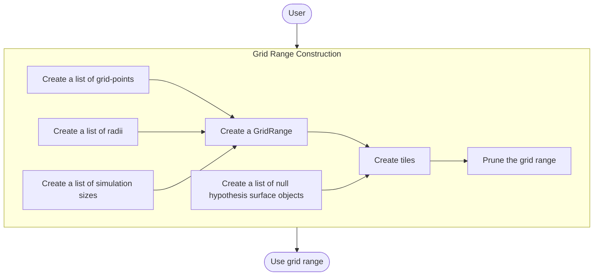
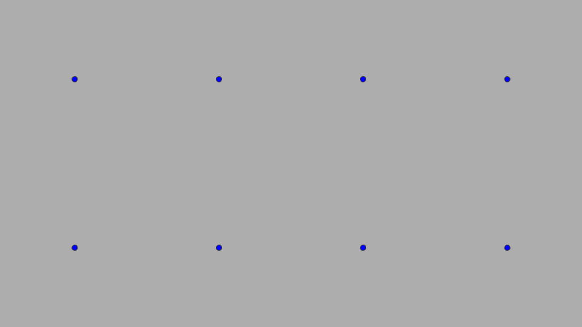
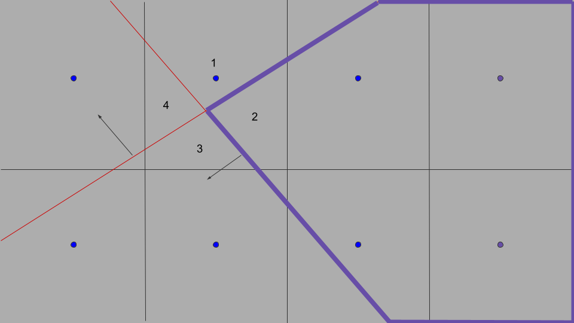

# Grid Range

In general, `kevlar` requires a notion of "a set of grid-points"
on which to simulate a given model.
As it turns out, we require a few more additional detail
to be able to integrate grid range into the framework.
This document covers the specification and the API
for our grid range class.

## Overview

A typical workflow of using a grid range is described below:

The following sections discuss in further detail
the subroutines depicted as rectangular tiles in the diagram above.

## Grid Range Specification

This section covers the required specification 
of a grid range concept.
Throughout this section, we will illustrate many concepts
using a running example of a user-defined grid-space.

### Grid-points

The first and foremost requirement is to store a list of grid-points.
As mentioned in [Grid Range](#grid-range),
this is the set of grid-points under which we simulate a given model.
An example is shown below with blue dots representing the grid-points
and the gray-space representing the grid-space of interest:

    

Note that the context, or meaning, of these points is defined by the model of interest.
See [Model](../model/model.md#attaching-gridrange) for more detail.
The user is responsible for constructing a valid list of grid-points
that adhere to the convention of the model of interest.

However, regardless of the context, 
a range of grid-points is still a meaningful quantity 
for the rest of the framework.
The framework only ever assumes that the grid-points lie in the space in which
we apply the Taylor expansion of the function of interest (e.g. Type I error function)
(see [KevlarBound](../../../math/bound/doc.pdf)).

### Radii

In [KevlarBound](../../../math/bound/doc.pdf),
the Type I error guarantees originate from having control of a Taylor expansion
around a small region `R` associated with each grid-point.
While it is true that `R` need not contain the corresponding grid-point,
accuracy is improved when it does. 
So, if a user has a grid-space they wish to get Type I error guarantees on,
we will assume that the space has been first partitioned by a set of hypercubes
where each hypercube is defined by a grid-point as in [Grid-points](#grid-points)
as the center and a radii vector that defines the radius along each direction.
The following pictures shows an example of a grid partitioned by
hypercubes with the same radii:

    

### Simulation Sizes

For each grid-point that we wish to simulate under,
we can associate it with a simulation size (number of simulations).
In general, we would like to be able to have different simulation sizes
for each grid-point because some points will result in a higher Type I error than others
and we wish to get a more accurate estimate in those regions.
During simulation, we can keep track of the number of finished simulations
and stop updating for those that reached the desired simulation size.

### Null Hypothesis Surfaces

### Tiles

Once the grid-point, radius, simulation size, 
and null hypothesis surface information are provided,
we can construct tile objects.

See [TODO: Tile](tile.md) for more detail.

TODO:
- meaning of gridpoints (delegate to model.md)
